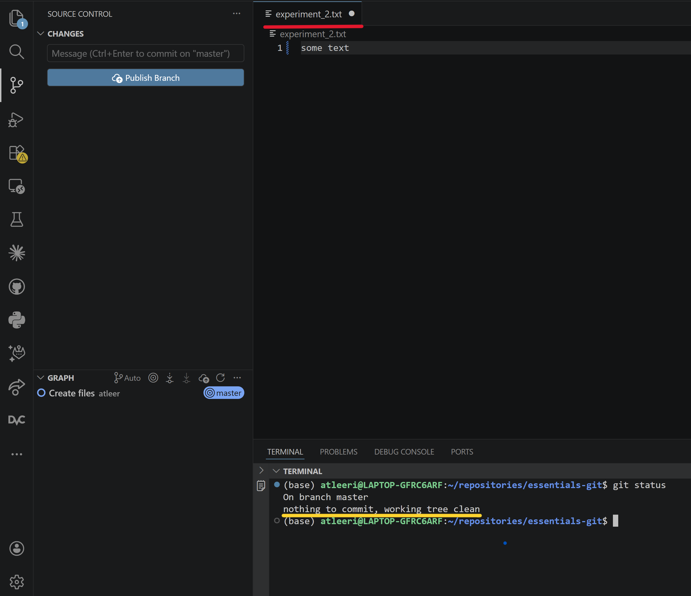
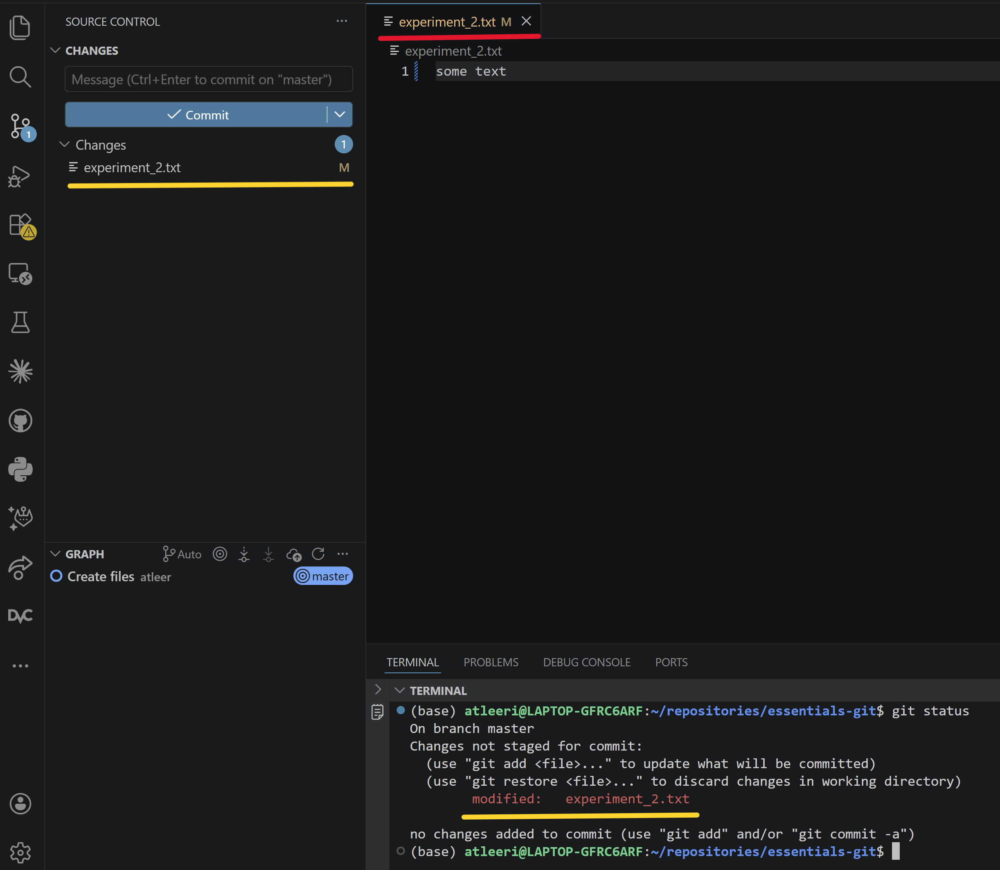

Writing code is often not a linear process, involving exploration, tinkering, and trial-and-error. Without the right tools, this can result in a messy codebase with multiple, slightly modified versions of the same code, making it hard to understand, maintain and reproduce the project.
Version control systems provide a solution for this: They record snapshots of your project at different points in time, which allows you to see what changed and why and to revert to previous versions of your code if needed.

Git is a distributed version control system and it is by far the most popular one with an adoption rate of [over 90%](https://rhodecode.com/blog/156/version-control-systems-popularity-in-2025) in the software industry.  In this lesson, you'll learn the basics of Git:
 how to track changes, view the project's history and restore old versions.

The materials feature two different ways of using git: the terminal and VSCode's graphical user interface (GUI).
It is recommended that you test out both methods because they each have their distinct advantages: The GUI provides a convenient interface that makes it easier to integrate Git into your workflow while the terminal allows you to use more advanced functionalities of Git that are not implemented in the GUI.

If you haven't installed Git already, go to the [website](https://git-scm.com/downloads/mac), download the installer for your operating system and follow the instructions (there are a lot of options in the installation - you can accept the defaults).
Then run the following commands in your terminal (replacing the text in quotations with your actual name and mail) so Git can associate your commits with your identity.

```bash
git config --global user.name "Your Name"
git config --global user.email "your.email@example.com"
```


## Initializing a Repository and Adding Files

### Background

At the beginning of every project, we initialize a new Git repository using the `git init` command. This will create the `.git` folder (which may be hidden, depending on your editor configuration) where Git stores the history of the project.
Once initialized, Git will watch for any new files or changes to existing files in the working directory.
When we use the `git status` command, Git prints a list of all current changes that have not yet been checked into the project's history.
In this section, we are going to use the `git add` command which stages files.
Staging means that a file is marked as ready to be committed (more on what this means in the next section).

### Exercises

In the following exercises you'll create a new repository, add some files and stage them for committing.
Here are the commands you need to know as well as the equivalent instructions for the VSCode Git GUI:


| Code                | Description                                             | VS Code GUI |
|---|---|---|
| `mkdir my_dir/` | Create a new directory `my_dir/` | N/A |
| `cd my_dir/` | Change the current directory to `my_dir/` | N/A |
| `cd ../` | Move to the parent of the current directory | N/A |
| `git init`            | Initialize a new Git repository in the current directory | Click **Source Control (Ctrl + Shift + G)** → Click **"Initialize Repository"** |
| `git status`          | Show the status of changes in the working directory      | Click **Source Control (Ctrl + Shift + G)** → See the file changes |
| `git add file1.txt`   | Stage `file1.txt` for commit                             | Click **➕ (plus) icon** next to the file in **Source Control** |
| `git add .`          | Stage all modified and new files                         | Click **➕ (plus) icon** next to each file OR Click **"Stage All Changes"** |
| `git reset file1.txt` | Unstage `file1.txt`                                      | Click **➖ (minus) icon** next to the file to move it back to "Changes" |

**Exercise**: Create a new empty folder and move there (either using your file explorer or the terminal commands `mkdir` and `cd`).


```python
mkdir /tmp/new_repo
cd /tmp/new_repo
```

    /tmp/new_repo


**Exercise**: Initialize a Git repository in this folder.  


```python
git init
```

    Initialized empty Git repository in /tmp/new_repo/.git/


**Exercise**: Check the status of the repository using `git status`.  


```python
git status
```

    On branch master
    
    No commits yet
    
    nothing to commit (create/copy files and use "git add" to track)


**Example**: Create and stage `experiment_1.txt`. 


```python
# after creating experiment_1.txt:
git add experiment_1.txt
```

**Exercise**: Create `experiment_2.txt` and `experiment_3.txt`. Stage both the files together.


```python
# after creating experiment_2.txt and experiment_3.txt:
git add .
```

**Exercise**: Unstage the `experiment_3.txt` and check the status.


```python
git reset experiment_3.txt
git status
```

    On branch master
    
    No commits yet
    
    Changes to be committed:
      (use "git rm --cached <file>..." to unstage)
    	new file:   experiment_1.txt
    	new file:   experiment_2.txt
    
    Untracked files:
      (use "git add <file>..." to include in what will be committed)
    	experiment_3.txt
    


**Exercise**: Delete `experiment_3.txt` and check the status.


```python
# after deleting experiment_3.txt:
git status
```

    On branch master
    
    No commits yet
    
    Changes to be committed:
      (use "git rm --cached <file>..." to unstage)
    	new file:   experiment_1.txt
    	new file:   experiment_2.txt
    


## Committing Changes and Viewing History 

### Background

The staged changes are still only temporary. To create a more permanent snapshot of your project, you need to save the staged changes using a `commit`. A commit records a snapshot of your project at a particular time described by a `commit message`. Essentially, your project will be a series of commits and the changes committed can be accessed via commit history.

Commits are saved in order, creating a history of changes in the project. You can see past commits using `git log`, which shows the commit hash, message, and time of each commit. In a typical workflow, you *stage* any change you make to the files in the temporary staging area and once you are happy with the changes you have made, you *commit* them. The points where you *stage* and *commit* are up to you.

The commit history also allows us to compare specific commits with `git diff`. The `diff` algorithm compares two files line-by-line to tell us exactly what has changed. We can select commits for `git diff` in two ways: either by using the **commit hash** which is the alphanumeric ID next to every commit in `git log` or by the position of the commit relative to `HEAD` (for example, `HEAD~1` will one commit before `HEAD`, i.e. the second most recent commit). Note that the commit hashes are **unique** for every repository so the ones you'll see in the exercises and solutions in this notebooks will not match the ones you'll see on your machine.

### Exercises

In the following exercises you will commit the staged changes and then edit and commit some more. You are also going to learn how to inspect the `git log` and compare specific commits with `git diff`. Here are the commands you need to know:

| Code | Description | VS Code GUI |
|---------|-------------|-------------|
| `git add f1.txt f2.txt` | Stage specific files for commit | Click **➕ (plus) icon** next to the files in **Source Control** |
| `git commit -m "Commit message"` | Commit staged files with a message | Click **✔ (checkmark) icon**, enter commit message, and press Enter |
| `git add .` | Stage modifications of all files | Click **➕ (plus) icon** next **Changes** |
| `git commit -am "Commit message"` | Stage and commit all modified files in one step | Click **"Stage All Changes"**, then **✔ (checkmark) icon** |
| `git log` | View the full commit history of the repository | **N/A** (Command-line only) |
| `git log --oneline` | View a compact version of the commit history | **N/A** (Command-line only) |
| `git log -2` | Display the last two commits | **N/A** (Command-line only) |
| `git diff d2dh5rt` | Compare the working directory to the commit with the hash `d2dh5rt` | Click on the file in **Source Control** and check the inline diff |
| `git diff HEAD~1` | Compare the working directory to the second most recent commit | Click on the file in **Source Control** and check the inline diff |
| `git diff HEAD~3 HEAD~2` | Compare the third and second most recent commits | **N/A** (Command-line only) |
| `git diff <commit-hash1> <commit-hash2>` | Compare two specific commits (the older commit goes first) | **N/A** (Command-line only) |


**Exercise**: Commit the staged files (`experiment_1.txt` and `experiment_2.txt`) with the message `"create files"`.    


```python
git commit -m "create files"
```

    [master (root-commit) 869a1f1] add files
     2 files changed, 2 insertions(+)
     create mode 100644 experiment_1.txt
     create mode 100644 experiment_2.txt


Now, we'll start making changes to files and commit those changes with git. If you don't have Auto Save enabled, you have to save the file after making a change by tapping Ctrl + s or cmd + s (on a Mac keyboard) for git to be able detect the change.

If you have made a change to a file, like adding text to it, but haven't saved it yet, there will be a white dot next to the filename in the tab in the editor (see red line in the screenshot below), the file while not show up under "Changes" in the source control, and when you check the status with `git status` in the terminal, it will say "nothing to commit, working tree clean" (see yellow line).



After saving the changes, the white dot next to the filename will disappear, the filename will show up under "Changes" in the source control, and when you check the status with `git status`, the output in the terminal will say that the file has been modified (see screenshot below).



You can enable Auto Save by clicking File in the top left corner of VS Code and then tick Auto Save.

**Exercise**: Add text to `experiment_1.txt` and commit with the message `"add data to exp 1"`.


```python
# after adding text to experiment_1.txt:
git add .
git commit -m "add data to exp 1"
```

    [master b29b8a2] add data to exp 1
     1 file changed, 1 insertion(+)


**Exercise**: Add some text into `experiment_2.txt`, modify `experiment_1.txt` and commit the changes with a suitable commit message.


```python
# after adding text to experiment_2.txt and modifying experiment_1.txt:
git add .
git commit -m "add data to exp 2 and modify exp 1"
```

    [master 860f8a7] add data to exp 2 and modify exp 1
     2 files changed, 2 insertions(+), 1 deletion(-)


**Exercise**: Modify both the files. Stage and commit in one step.


```python
# After modifying both files:
git commit -am "modify exp 1 and 2"
```

    [master 00c7625] add more data to exp 1 and 2
     2 files changed, 2 insertions(+)


**Exercise**: View the full commit history of the repository.


```python
git log
```

    commit 00c762504b59388d63216529ae842d79481aa83b (HEAD -> master)
    Author: obi <ole.bialas@posteo.de>
    Date:   Mon Dec 15 14:57:56 2025 +0100
    
        add more data to exp 1 and 2
    
    commit 860f8a7ff466be7d83bc3476fe015b45a2d96112
    Author: obi <ole.bialas@posteo.de>
    Date:   Mon Dec 15 14:57:56 2025 +0100
    
        add data to exp 2 and modify exp 1
    
    commit b29b8a2d8d1cdd8c945dde94bed4a79210cf96fa
    Author: obi <ole.bialas@posteo.de>
    Date:   Mon Dec 15 14:57:55 2025 +0100
    
        add data to exp 1
    
    commit 869a1f1d5308f59d0ffe63bb8bb40af06f438b9c
    Author: obi <ole.bialas@posteo.de>
    Date:   Mon Dec 15 14:57:54 2025 +0100
    
        add files


**Exercise**: Check a compact version of the commit history.


```python
git log --oneline
```

    00c7625 (HEAD -> master) add more data to exp 1 and 2
    860f8a7 add data to exp 2 and modify exp 1
    b29b8a2 add data to exp 1
    869a1f1 add files


**Exercise**: Display the history of the last three commits.


```python
git log -3
```

    commit 00c762504b59388d63216529ae842d79481aa83b (HEAD -> master)
    Author: obi <ole.bialas@posteo.de>
    Date:   Mon Dec 15 14:57:56 2025 +0100
    
        add more data to exp 1 and 2
    
    commit 860f8a7ff466be7d83bc3476fe015b45a2d96112
    Author: obi <ole.bialas@posteo.de>
    Date:   Mon Dec 15 14:57:56 2025 +0100
    
        add data to exp 2 and modify exp 1
    
    commit b29b8a2d8d1cdd8c945dde94bed4a79210cf96fa
    Author: obi <ole.bialas@posteo.de>
    Date:   Mon Dec 15 14:57:55 2025 +0100
    
        add data to exp 1


**Example**: Compare the most recent commit and the working directory.


```python
git diff HEAD~1 # alternatively, use the commit hash
```

    diff --git a/experiment_1.txt b/experiment_1.txt
    index 1984e41..4635490 100644
    --- a/experiment_1.txt
    +++ b/experiment_1.txt
    @@ -1 +1,2 @@
     asjdhsajhd
    +217336
    diff --git a/experiment_2.txt b/experiment_2.txt
    index ccd744b..c842e70 100644
    --- a/experiment_2.txt
    +++ b/experiment_2.txt
    @@ -1,3 +1,4 @@
     This is the 2nd experiment
     There are 3 conditions
     1273672
    +aodhahd


**Exercise**: Compare the differences between the third-most-recent commit and the working directory.


```python
git diff HEAD~2 # alternatively, use the commit hash
```

    diff --git a/experiment_1.txt b/experiment_1.txt
    index e9d916c..4635490 100644
    --- a/experiment_1.txt
    +++ b/experiment_1.txt
    @@ -1 +1,2 @@
    -This is the 1st experiment
    +asjdhsajhd
    +217336
    diff --git a/experiment_2.txt b/experiment_2.txt
    index f811332..c842e70 100644
    --- a/experiment_2.txt
    +++ b/experiment_2.txt
    @@ -1,2 +1,4 @@
     This is the 2nd experiment
     There are 3 conditions
    +1273672
    +aodhahd


**Exercise**: Compare two specific commits.


```python
git diff HEAD~3 HEAD~2 # alternatively, use the commit hashes
```

    diff --git a/experiment_2.txt b/experiment_2.txt
    index bfa0eae..f811332 100644
    --- a/experiment_2.txt
    +++ b/experiment_2.txt
    @@ -1 +1,2 @@
     This is the 2nd experiment
    +There are 3 conditions


## Ignoring Files

### Background

Per default, Git tracks every file in the directory. However, some files and folders should not be tracked. For example, Git is not intended to be used for large files, so you should not let Git track your neural recordings.
To prevent Git from tracking specific files, we can create a file called `.gitignore` and add the to-be-ignored files.
`.gitignore` is simply a text file where you can either list individual files or patterns such as `*.pdf` or `subject*` which means "ignore every file/folder ending with `.pdf` or starting with `subject`".
There are also [.gitignore generators](https://www.toptal.com/developers/gitignore) that provide ready-made templates with files and patterns that are commonly ignored for a given language.

Importantly, adding a file to `.gitignore` that is already tracked by git will not automatically make Git drop it. To do this, you need to call `git rm --cached <file>` which will remove them from Git's index but keep them as files in your working directory. While Git will ignore changes in these files going forward, it will not remove them from the commit history so they can still be restored later.
Note that editing `.gitignore` and running `git rm --cached` are changes that need to be committed to be effective.

### Exercises

In the following exercises you will create a `.gitignore` file, add files to ignore and observe how this affects Git's behavior. Here are the commands you need to know:


| Code | Description | VS Code GUI |
|---------|-------------|-------------|
| `git status`          | Show the status of changes in the working directory      | Click **Source Control (Ctrl + Shift + G)** → See the file changes |
| `git add f1.txt f2.txt` | Stage specific files for commit | Click **➕ (plus) icon** next to the files in **Source Control** |
| `git add .` | Stage modifications of all files | Click **➕ (plus) icon** next **Changes** |
| `git commit -m "Commit message"` | Commit staged files with a message | Click **✔ (checkmark) icon**, enter commit message, and press Enter |
| `git commit -am "Commit message"` | Stage and commit all modified files in one step | Click **"Stage All Changes"**, then **✔ (checkmark) icon** |
| `git rm --cached <file>`  | Remove the file from Git's index | **N/A** (command line only) |

**Exercise**: Create the `.gitignore` file in your folder and add `experiment_4.txt` to it. Then stage and commit the file.


```python
# after creating gitignore and adding experiment_4.txt:
git add .
git commit -m "add .gitignore"
```

    [master 71f14a7] add .gitignore
     1 file changed, 1 insertion(+)
     create mode 100644 .gitignore


**Exercise**: Create `experiment_4.txt` and check `git status`. You should not see any untracked changes because the file should be ignored.


```python
git status
```

    On branch master
    nothing to commit, working tree clean


**Exercise**: Add `*.txt` to `.gitignore` to ignore all text files and commit.


```python
# after adding *.txt to .gitignore
git commit -am "ignore all text files"
```

    [master 195e7cd] ignore all text files
     1 file changed, 1 insertion(+), 1 deletion(-)


**Example**: Use `git rm --cached` to remove `experiment_1.txt` from Git's index but keep it in your working directory and commit.


```python
git rm --cached experiment_1.txt
git commit -am "rm experiment_1.txt"
```

    rm 'experiment_1.txt'
    [master 93a2c72] rm experiment_1.txt
     1 file changed, 2 deletions(-)
     delete mode 100644 experiment_1.txt


**Exercise**: Use `git rm --cached` to remove `experiment_2.txt` from Git's index but keep it in your working directory and commit.


```python
git rm --cached experiment_2.txt
git commit -am "rm experiment_2.txt"
```

    rm 'experiment_2.txt'
    [master 94a3f04] rm experiment_2.txt
     1 file changed, 4 deletions(-)
     delete mode 100644 experiment_2.txt


**Exercise**: Modify `experiment_2.txt` and check `git status` - it should not show any changes.


```python
git status
```

    On branch master
    nothing to commit, working tree clean


## Reverting to Older Versions  

### Background

Because Git keeps the full history of all files, it allows you to go back to a previous version of your work if needed. There are several ways of doing this - in this section, we will use `git revert`. Reverting is a safe mechanism for restoring previous file versions because you do not risk losing anything. Revert will simply create a new commit to undo a selected commit. This is where granular commits with descriptive messages are very useful because they allow you to identify and revert specific changes.

The downside of `git revert` is that it may cause merge conflicts. If you are trying to undo a line that has been modified again in later commits git does not know what to do. Should it undo the requested commit as well as the later one or keep the later one and ignore the revert? In these cases, Git will warn you about a merge conflict which means that you have to select manually what to keep and what to drop.
While handling merge conflicts is beyond the scope of this notebook, you'll at least see how this looks.

### Exercises

In the following exercises, you'll use `revert` to restore previous versions of the repository. You'll also see how merge conflicts can happen when reverting.

| Code                      | Description                                         | VS Code GUI |
|---|---|---|
| `git log --oneline`          | Shows commit history in a short format             | NA |
| `git revert HEAD`   | Revert the most recent commit | NA |
| `git revert <commit-hash>`   | Creates a new commit that undoes only the specified commit | NA |

**Exercise**: Use `git log --oneline` to view the commit history.  


```python
git log --oneline
```

    94a3f04 (HEAD -> master) rm experiment_2.txt
    93a2c72 rm experiment_1.txt
    195e7cd ignore all text files
    71f14a7 add .gitignore
    00c7625 add more data to exp 1 and 2
    860f8a7 add data to exp 2 and modify exp 1
    b29b8a2 add data to exp 1
    869a1f1 add files


**Exercise**: Revert the latest commit using `git revert HEAD`. This may open the text editor VIM to edit your commit message. To exit VIM, press Esc, type `:wq` (w for write, q for quit) and hit Enter.


```python
git revert HEAD
```

    [master d4af068] Revert "rm experiment_2.txt"
     Date: Mon Dec 15 14:58:01 2025 +0100
     1 file changed, 4 insertions(+)
     create mode 100644 experiment_2.txt


**Exercise**: Check the `git log` to view the latest commit made by `revert` (you can use `git log -1` to show only the most recent commit).


```python
git log -1
```

    commit d4af06863b88cdf90bf915ad248e240a5164a6e0 (HEAD -> master)
    Author: obi <ole.bialas@posteo.de>
    Date:   Mon Dec 15 14:58:01 2025 +0100
    
        Revert "rm experiment_2.txt"
        
        This reverts commit 94a3f0461ff9569868e5426f545bbc064ca785f8.


**Bonus Exercise**: Replace the entire content of `experiment_2.txt` and commit. Then, identify and `git revert` the commit where you modified `experiment_2.txt` for the first time. Does this cause a merge conflict? What does the message say?


```python
# after changing the content of experiment_2.txt:
git revert HEAD~6
```

    [master 90bad7e] New version of experiment_2.txt
     1 file changed, 1 insertion(+), 4 deletions(-)
    CONFLICT (modify/delete): experiment_1.txt deleted in HEAD and modified in parent of 00c7625 (add more data to exp 1 and 2).  Version parent of 00c7625 (add more data to exp 1 and 2) of experiment_1.txt left in tree.
    Auto-merging experiment_2.txt
    CONFLICT (content): Merge conflict in experiment_2.txt
    error: could not revert 00c7625... add more data to exp 1 and 2
    hint: After resolving the conflicts, mark them with
    hint: "git add/rm <pathspec>", then run
    hint: "git revert --continue".
    hint: You can instead skip this commit with "git revert --skip".
    hint: To abort and get back to the state before "git revert",
    hint: run "git revert --abort".

